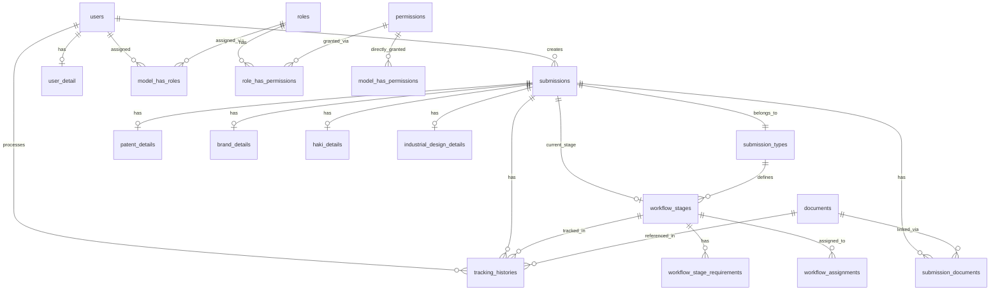

# Copilot Instructions for PKKI ITERA Laravel Project

## Project Overview
This is a Laravel application for PKKI ITERA (Pusat Kelola Kekayaan Instelektual Institut Teknologi Sumatera) built with Filament admin panel, focusing on intellectual property management, submissions, and user management with role-based access control.

## Technology Stack
- **Framework**: Laravel 10.x
- **Admin Panel**: Filament 3.x
- **Database**: MySQL
- **Authentication**: Laravel Sanctum + Filament Auth
- **Authorization**: Spatie Permission + Filament Shield
- **Frontend**: Livewire + Alpine.js for filament , inertia + react for frontend 
- **Build Tool**: Vite
- **CSS Framework**: Tailwind CSS
- **File Management**: Spatie Media Library

## UI/UX Design Principles for Non-Technical Users

### Target User Profile
Our primary users are:
- **Non-technical individuals** (civitas and general public)
- **Elderly users** (professors, researchers, community members)
- **People with limited technology literacy**
- **Users who prefer simple, clear interfaces**

### Core Design Philosophy
**"Simplicity First, Elegance Always"** - Every interface should be intuitive enough for a first-time user to complete their task without training.

### 1. Visual Design Standards

#### Typography & Readability
```css
/* Use larger, readable fonts */
.text-primary { font-size: 16px; line-height: 1.6; } /* Minimum body text */
.text-heading { font-size: 24px; font-weight: 600; } /* Clear hierarchy */
.text-label { font-size: 14px; font-weight: 500; } /* Form labels */

/* High contrast colors for accessibility */
.text-dark { color: #1f2937; } /* Dark gray instead of pure black */
.text-muted { color: #6b7280; } /* Accessible light gray */
```

#### Color Scheme
```php
// Filament theme configuration - Use calm, professional colors
'primary' => [
    50 => '#eff6ff',   // Very light blue
    500 => '#3b82f6',  // Primary blue (accessible)
    600 => '#2563eb',  // Darker blue for hover states
    900 => '#1e3a8a',  // Dark blue for text
],
'success' => '#10b981', // Green for success states
'warning' => '#f59e0b', // Amber for warnings
'danger' => '#ef4444',  // Red for errors
```

#### Spacing & Layout
```php
// Generous spacing for comfortable interaction
public static function form(Form $form): Form
{
    return $form->schema([
        Section::make('Informasi Dasar')
            ->description('Isi informasi dasar pengajuan Anda')
            ->schema([
                TextInput::make('title')
                    ->label('Judul Pengajuan')
                    ->placeholder('Contoh: Aplikasi Mobile untuk...')
                    ->helperText('Berikan judul yang jelas dan mudah dimengerti')
                    ->required(),
            ])
            ->columnSpan(2)
            ->extraAttributes(['class' => 'p-6']), // Extra padding
    ]);
}
```

### 2. Information Architecture

#### Clear Navigation Structure
```php
// Filament navigation - Simple, logical grouping
public static function getNavigationItems(): array
{
    return [
        NavigationItem::make('Beranda')
            ->icon('heroicon-o-home')
            ->url('/admin'),
            
        NavigationGroup::make('Pengajuan Saya')
            ->items([
                NavigationItem::make('Buat Pengajuan Baru')
                    ->icon('heroicon-o-plus-circle')
                    ->url('/admin/submissions/create'),
                NavigationItem::make('Daftar Pengajuan')
                    ->icon('heroicon-o-document-text')
                    ->url('/admin/submissions'),
            ]),
            
        NavigationItem::make('Bantuan')
            ->icon('heroicon-o-question-mark-circle')
            ->url('/admin/help'),
    ];
}
```

#### Breadcrumb Implementation
```php
// Always show clear breadcrumbs
protected function getBreadcrumbs(): array
{
    return [
        'Beranda' => '/admin',
        'Pengajuan' => '/admin/submissions',
        'Buat Pengajuan Baru' => null, // Current page
    ];
}
```

### 3. Form Design Best Practices

#### Progressive Disclosure
```php
// Break complex forms into simple steps
class CreateSubmissionWizard extends CreateRecord
{
    use HasWizard;
    
    protected function getSteps(): array
    {
        return [
            Step::make('Jenis Pengajuan')
                ->description('Pilih jenis kekayaan intelektual yang akan diajukan')
                ->schema([
                    Select::make('submission_type_id')
                        ->label('Jenis Pengajuan')
                        ->options([
                            'paten' => '📋 Paten - Untuk penemuan/inovasi teknologi',
                            'brand' => '🏷️ Merek - Untuk nama/logo produk',
                            'haki' => '📚 Hak Cipta - Untuk karya tulis/seni',
                            'desain' => '🎨 Desain Industri - Untuk desain produk',
                        ])
                        ->native(false) // Use custom select for better UX
                        ->searchable(false)
                        ->required(),
                ]),
                
            Step::make('Informasi Dasar')
                ->description('Isi informasi dasar tentang pengajuan Anda')
                ->schema([
                    TextInput::make('title')
                        ->label('Judul/Nama')
                        ->placeholder('Berikan nama yang jelas dan mudah dimengerti')
                        ->maxLength(255)
                        ->required(),
                        
                    Textarea::make('description')
                        ->label('Deskripsi Singkat')
                        ->placeholder('Jelaskan secara singkat tentang pengajuan Anda')
                        ->rows(4)
                        ->maxLength(1000),
                ]),
                
            Step::make('Dokumen')
                ->description('Unggah dokumen pendukung (opsional pada tahap ini)')
                ->schema([
                    FileUpload::make('documents')
                        ->label('Dokumen Pendukung')
                        ->multiple()
                        ->acceptedFileTypes(['application/pdf', 'application/msword'])
                        ->maxSize(10240) // 10MB
                        ->helperText('Format: PDF atau Word, maksimal 10MB per file')
                        ->directory('submissions'),
                ]),
        ];
    }
}
```

#### Smart Defaults & Validation
```php
// Provide helpful defaults and clear validation messages
public static function form(Form $form): Form
{
    return $form->schema([
        TextInput::make('email')
            ->label('Alamat Email')
            ->email()
            ->required()
            ->validationMessages([
                'email' => 'Format email tidak valid. Contoh: nama@domain.com',
                'required' => 'Email wajib diisi untuk komunikasi lebih lanjut',
            ]),
            
        TextInput::make('phone')
            ->label('Nomor WhatsApp')
            ->placeholder('Contoh: 08123456789')
            ->tel()
            ->prefixIcon('heroicon-o-phone')
            ->helperText('Nomor akan digunakan untuk notifikasi penting'),
    ]);
}
```

### 4. Interaction Design

#### Loading States & Feedback
```php
// Provide clear feedback for all actions
class SubmissionResource extends Resource
{
    public static function table(Table $table): Table
    {
        return $table
            ->columns([
                TextColumn::make('title')
                    ->label('Judul Pengajuan')
                    ->searchable()
                    ->sortable(),
                    
                BadgeColumn::make('status')
                    ->label('Status')
                    ->colors([
                        'secondary' => 'draft',
                        'warning' => 'submitted',
                        'primary' => 'in_review',
                        'success' => 'approved',
                        'danger' => 'rejected',
                    ])
                    ->icons([
                        'heroicon-o-pencil' => 'draft',
                        'heroicon-o-clock' => 'submitted',
                        'heroicon-o-eye' => 'in_review',
                        'heroicon-o-check-circle' => 'approved',
                        'heroicon-o-x-circle' => 'rejected',
                    ]),
            ])
            ->actions([
                Action::make('view')
                    ->label('Lihat Detail')
                    ->icon('heroicon-o-eye')
                    ->color('primary'),
            ])
            ->emptyStateHeading('Belum Ada Pengajuan')
            ->emptyStateDescription('Klik tombol "Buat Pengajuan Baru" untuk memulai')
            ->emptyStateIcon('heroicon-o-document-plus');
    }
}
```

#### Error Handling & Success Messages
```php
// Clear, actionable error messages
protected function getCreatedNotificationTitle(): ?string
{
    return '✅ Pengajuan berhasil dibuat! Kami akan segera meninjaunya.';
}

protected function getCreatedNotification(): ?Notification
{
    return Notification::make()
        ->success()
        ->title('Pengajuan Berhasil Dibuat!')
        ->body('Tim PKKI ITERA akan meninjau pengajuan Anda dalam 2-3 hari kerja. Anda akan mendapat notifikasi melalui email.')
        ->actions([
            Action::make('view')
                ->button()
                ->label('Lihat Pengajuan')
                ->url(fn () => SubmissionResource::getUrl('view', ['record' => $this->record])),
        ])
        ->persistent(); // Keep notification visible longer
}
```

### 5. Content Strategy

#### Language & Tone
```php
// Use simple, friendly Indonesian language
public static function getModelLabel(): string
{
    return 'Pengajuan'; // Not "Submission"
}

public static function getNavigationLabel(): string
{
    return 'Daftar Pengajuan Saya'; // Clear, personal
}

// Help text should be conversational
TextInput::make('patent_title')
    ->label('Judul Paten')
    ->helperText('Berikan judul yang menjelaskan apa yang Anda temukan. Contoh: "Aplikasi Mobile untuk Deteksi Penyakit Tanaman"')
    ->placeholder('Tuliskan judul penemuan Anda...');
```

#### Progress Indicators
```php
// Show clear progress throughout workflows
public function getSubNavigationPosition(): SubNavigationPosition
{
    return SubNavigationPosition::Top;
}

protected function getHeaderWidgets(): array
{
    return [
        SubmissionProgressWidget::class, // Custom widget showing completion status
    ];
}

// Progress widget example
class SubmissionProgressWidget extends Widget
{
    protected static string $view = 'filament.widgets.submission-progress';
    
    protected function getViewData(): array
    {
        return [
            'steps' => [
                '✅ Informasi Dasar' => true,
                '✅ Detail Pengajuan' => true,
                '⏳ Dokumen Pendukung' => false,
                '⭕ Peninjauan' => false,
            ],
            'currentStep' => 3,
            'totalSteps' => 4,
        ];
    }
}
```

### 6. Accessibility Standards

#### Keyboard Navigation
```php
// Ensure all interactive elements are keyboard accessible
TextInput::make('title')
    ->autofocus() // Clear focus management
    ->extraAttributes([
        'tabindex' => '1',
        'aria-label' => 'Judul pengajuan kekayaan intelektual',
    ]);
```

#### Screen Reader Support
```php
// Proper ARIA labels and descriptions
FileUpload::make('documents')
    ->label('Dokumen Pendukung')
    ->extraAttributes([
        'aria-describedby' => 'document-help',
        'role' => 'button',
    ])
    ->helperText('Unggah file PDF atau Word dengan ukuran maksimal 10MB');
```

### 7. Mobile-First Design

#### Responsive Components
```php
// Ensure all forms work well on mobile
public static function form(Form $form): Form
{
    return $form
        ->schema([
            Section::make('Informasi Pengajuan')
                ->schema([
                    TextInput::make('title')
                        ->label('Judul')
                        ->columnSpan([
                            'sm' => 2, // Full width on small screens
                            'md' => 1, // Half width on medium+ screens
                        ]),
                ])
                ->columns([
                    'sm' => 1, // Single column on mobile
                    'md' => 2, // Two columns on desktop
                ]),
        ]);
}
```

### 8. Help & Documentation

#### Contextual Help
```php
// Provide help exactly when needed
Select::make('submission_type_id')
    ->label('Jenis Pengajuan')
    ->options(SubmissionType::all()->pluck('name', 'id'))
    ->suffixAction(
        Action::make('help')
            ->icon('heroicon-o-question-mark-circle')
            ->tooltip('Bantuan memilih jenis pengajuan')
            ->modalContent(view('help.submission-types'))
            ->modalSubmitAction(false)
            ->modalCancelActionLabel('Tutup')
    );
```

#### Onboarding Flow
```php
// First-time user guidance
class OnboardingWidget extends Widget
{
    protected static string $view = 'filament.widgets.onboarding';
    
    public function shouldShow(): bool
    {
        return auth()->user()->submissions()->count() === 0;
    }
    
    protected function getViewData(): array
    {
        return [
            'steps' => [
                'Selamat datang di PKKI ITERA! Mari mulai dengan pengajuan pertama Anda.',
                'Pilih jenis kekayaan intelektual yang ingin Anda ajukan.',
                'Isi informasi dasar dengan lengkap dan jelas.',
                'Unggah dokumen pendukung jika sudah siap.',
                'Kirim pengajuan dan tunggu konfirmasi dari tim kami.',
            ],
        ];
    }
}
```

### 9. Performance for Low-End Devices

#### Optimized Loading
```php
// Lazy load heavy components
public static function table(Table $table): Table
{
    return $table
        ->defaultPaginationPageOption(10) // Smaller page sizes
        ->deferLoading() // Lazy load table data
        ->striped()
        ->columns([
            TextColumn::make('title')
                ->label('Judul')
                ->limit(50) // Prevent layout issues
                ->tooltip(fn ($record) => $record->title),
        ]);
}
```

### 10. Testing with Real Users

#### Usability Testing Checklist
```php
// Include these scenarios in testing
/*
✅ Can a 60+ year old professor submit a patent application?
✅ Can someone with basic smartphone skills navigate the interface?
✅ Are error messages helpful rather than technical?
✅ Can users complete tasks without asking for help?
✅ Do loading states prevent user confusion?
✅ Are success confirmations clear and reassuring?
*/
```

## Architecture Principles

### 1. Domain-Driven Design (DDD) Patterns
```php
// Organize code by business domains
app/
├── Models/          // Eloquent models (Entities)
├── Services/        // Business logic layer
├── Repositories/    // Data access layer
├── Policies/        // Authorization logic
├── Observers/       // Model event handlers
├── Events/          // Domain events
├── Listeners/       // Event handlers
└── Enums/          // Value objects
```

### 2. SOLID Principles Implementation
- **Single Responsibility**: Each class should have one reason to change
- **Open/Closed**: Open for extension, closed for modification
- **Liskov Substitution**: Derived classes must be substitutable for base classes
- **Interface Segregation**: Clients shouldn't depend on unused interfaces
- **Dependency Inversion**: Depend on abstractions, not concretions

## Code Standards & Best Practices

### Laravel Conventions
```php
// Model naming: Singular, PascalCase
class User extends Model {}
class SubmissionType extends Model {}

// Controller naming: PascalCase + Controller suffix
class UserController extends Controller {}
class SubmissionController extends Controller {}

// Migration naming: snake_case with descriptive action
2024_01_01_000000_create_users_table.php
2024_01_01_000001_add_email_verification_to_users_table.php

// Route naming: snake_case with dot notation
Route::name('admin.')->group(function () {
    Route::resource('submissions', SubmissionController::class);
});
```

### Database Design Principles
```php
// Use UUIDs for primary keys (already implemented)
use Illuminate\Database\Eloquent\Concerns\HasUuids;

class User extends Model
{
    use HasUuids;
    
    // Explicit fillable for mass assignment protection
    protected $fillable = [
        'fullname',
        'email',
        'password',
    ];
    
    // Define relationships with proper naming
    public function detail(): HasOne
    {
        return $this->hasOne(UserDetail::class);
    }
    
    public function submissions(): HasMany
    {
        return $this->hasMany(Submission::class);
    }
}
```

### Service Layer Pattern
```php
// Create services for complex business logic
namespace App\Services;

class SubmissionService
{
    public function __construct(
        private SubmissionRepository $repository,
        private NotificationService $notificationService
    ) {}
    
    public function createSubmission(array $data, User $user): Submission
    {
        DB::beginTransaction();
        
        try {
            $submission = $this->repository->create($data, $user);
            $this->notificationService->sendSubmissionCreatedNotification($submission);
            
            DB::commit();
            return $submission;
        } catch (Exception $e) {
            DB::rollBack();
            throw $e;
        }
    }
}
```

### Repository Pattern
```php
// Use repositories for data access abstraction
namespace App\Repositories;

interface SubmissionRepositoryInterface
{
    public function findByUser(User $user): Collection;
    public function findByStatus(string $status): Collection;
}

class SubmissionRepository implements SubmissionRepositoryInterface
{
    public function findByUser(User $user): Collection
    {
        return Submission::where('user_id', $user->id)
            ->with(['submissionType', 'currentStage'])
            ->get();
    }
}
```

## Filament Best Practices

### Resource Organization
```php
// Use sections for better form organization
public static function form(Form $form): Form
{
    return $form->schema([
        Section::make('Basic Information')
            ->description('Enter the basic submission details')
            ->schema([
                TextInput::make('title')->required(),
                Select::make('submission_type_id')->required(),
            ]),
            
        Section::make('Documents')
            ->schema([
                SpatieMediaLibraryFileUpload::make('attachments')
                    ->collection('submissions')
                    ->multiple(),
            ]),
    ]);
}

// Use custom pages for complex workflows
class CreateSubmission extends CreateRecord
{
    use HasWizard;
    
    protected function getSteps(): array
    {
        return [
            Step::make('Basic Info'),
            Step::make('Details'),
            Step::make('Documents'),
        ];
    }
}
```

### Performance Optimization
```php
// Eager load relationships to prevent N+1 queries
public static function table(Table $table): Table
{
    return $table
        ->query(
            Submission::with(['user', 'submissionType', 'currentStage'])
        )
        ->columns([
            TextColumn::make('user.fullname'),
            TextColumn::make('submissionType.name'),
        ]);
}

// Use database transactions for data integrity
protected function afterCreate(): void
{
    DB::transaction(function () {
        $this->record->update(['status' => 'submitted']);
        $this->createInitialWorkflowStage();
    });
}
```

## Security Best Practices

### Authentication & Authorization
```php
// Use Spatie Permission for role-based access
class UserPolicy
{
    public function viewAny(User $user): bool
    {
        return $user->can('view_any_user');
    }
    
    public function create(User $user): bool
    {
        return $user->can('create_user');
    }
}

// Implement proper validation
class CreateSubmissionRequest extends FormRequest
{
    public function rules(): array
    {
        return [
            'title' => 'required|string|max:255',
            'submission_type_id' => 'required|exists:submission_types,id',
            'documents.*' => 'file|mimes:pdf,doc,docx|max:10240',
        ];
    }
}
```

### Data Protection
```php
// Use accessors/mutators for sensitive data
class User extends Model
{
    protected $hidden = ['password', 'remember_token'];
    
    protected $casts = [
        'email_verified_at' => 'datetime',
        'password' => 'hashed',
    ];
    
    // Scope sensitive queries
    public function scopeVerified(Builder $query): Builder
    {
        return $query->whereNotNull('email_verified_at');
    }
}
```

## Error Handling & Logging

### Exception Handling
```php
// Create custom exceptions for domain-specific errors
class SubmissionException extends Exception
{
    public static function invalidStatus(string $status): self
    {
        return new self("Invalid submission status: {$status}");
    }
}

// Use structured logging
Log::channel('submissions')->info('Submission created', [
    'submission_id' => $submission->id,
    'user_id' => $user->id,
    'type' => $submission->submissionType->name,
]);
```

## Testing Standards

### Unit Testing
```php
class SubmissionServiceTest extends TestCase
{
    use RefreshDatabase;
    
    public function test_can_create_submission(): void
    {
        $user = User::factory()->create();
        $data = [
            'title' => 'Test Submission',
            'submission_type_id' => SubmissionType::factory()->create()->id,
        ];
        
        $submission = app(SubmissionService::class)->createSubmission($data, $user);
        
        $this->assertInstanceOf(Submission::class, $submission);
        $this->assertEquals('Test Submission', $submission->title);
    }
}
```

### Feature Testing
```php
class SubmissionManagementTest extends TestCase
{
    public function test_user_can_create_submission(): void
    {
        $user = User::factory()->create();
        
        $response = $this->actingAs($user)
            ->post('/admin/submissions', [
                'title' => 'Patent Application',
                'submission_type_id' => SubmissionType::factory()->create()->id,
            ]);
            
        $response->assertRedirect();
        $this->assertDatabaseHas('submissions', ['title' => 'Patent Application']);
    }
}
```

## Performance Guidelines

### Database Optimization
```php
// Use indexes for frequently queried columns
Schema::table('submissions', function (Blueprint $table) {
    $table->index(['status', 'created_at']);
    $table->index(['user_id', 'submission_type_id']);
});

// Implement query scopes for complex queries
class Submission extends Model
{
    public function scopeByStatus(Builder $query, string $status): Builder
    {
        return $query->where('status', $status);
    }
    
    public function scopeRecent(Builder $query, int $days = 30): Builder
    {
        return $query->where('created_at', '>=', now()->subDays($days));
    }
}
```

### Caching Strategy
```php
// Cache expensive queries
class SubmissionService
{
    public function getSubmissionStats(): array
    {
        return Cache::remember('submission_stats', 3600, function () {
            return [
                'total' => Submission::count(),
                'pending' => Submission::byStatus('pending')->count(),
                'approved' => Submission::byStatus('approved')->count(),
            ];
        });
    }
}
```

## Code Review Checklist

### Before Committing
- [ ] Follow PSR-12 coding standards
- [ ] Add proper type hints and return types
- [ ] Include PHPDoc blocks for public methods
- [ ] Validate all user inputs
- [ ] Use database transactions for multi-step operations
- [ ] Add appropriate indexes for new queries
- [ ] Write tests for new functionality
- [ ] Update documentation if needed

### Filament Specific
- [ ] Use proper form validation
- [ ] Implement proper authorization checks
- [ ] Optimize table queries with eager loading
- [ ] Use appropriate field types for data
- [ ] Handle file uploads securely
- [ ] Implement proper error messages

## Deployment & Environment

### Production Checklist
```bash
# Optimize for production
php artisan config:cache
php artisan route:cache
php artisan view:cache
php artisan icons:cache
php artisan shield:generate --all

# Database optimizations
php artisan migrate --force
php artisan db:seed --force
```

### Environment Variables
```env
# Security
APP_ENV=production
APP_DEBUG=false
APP_KEY=<strong-random-key>

# Database
DB_CONNECTION=mysql
DB_HOST=127.0.0.1
DB_PORT=3306
DB_DATABASE=pkki_itera_prod

# Mail
MAIL_MAILER=smtp
MAIL_HOST=smtp.gmail.com
MAIL_PORT=587
MAIL_USERNAME=your-email@domain.com
MAIL_PASSWORD=your-app-password
```

## Common Patterns & Anti-Patterns

### ✅ Good Practices
```php
// Use dependency injection
class SubmissionController extends Controller
{
    public function __construct(
        private SubmissionService $submissionService
    ) {}
}

// Use resource collections for API responses
class SubmissionResource extends JsonResource
{
    public function toArray($request): array
    {
        return [
            'id' => $this->id,
            'title' => $this->title,
            'status' => $this->status,
            'created_at' => $this->created_at->toISOString(),
        ];
    }
}
```

### ❌ Anti-Patterns to Avoid
```php
// Don't put business logic in controllers
class SubmissionController extends Controller
{
    public function store(Request $request)
    {
        // ❌ Avoid this - business logic in controller
        $submission = new Submission();
        $submission->title = $request->title;
        $submission->save();
        
        // Send email here...
        // Update related records...
    }
}

// Don't use raw queries unless absolutely necessary
// ❌ Avoid this
DB::select('SELECT * FROM submissions WHERE status = ?', ['pending']);

// ✅ Use Eloquent instead
Submission::where('status', 'pending')->get();
```

## Documentation Standards

### Code Documentation
```php
/**
 * Create a new submission with proper workflow initialization.
 *
 * @param array $data The submission data
 * @param User $user The user creating the submission
 * @return Submission The created submission
 * @throws SubmissionException When submission data is invalid
 */
public function createSubmission(array $data, User $user): Submission
{
    // Implementation here...
}
```

### API Documentation
Use OpenAPI/Swagger standards for API documentation and maintain updated README.md files for major features.

---

## Contact & Resources

For questions about this codebase or implementation details:
- **Project**: PKKI ITERA
- **Documentation**: See `/docs` directory
- **Repository**: [PKKI ITERA GitHub](https://github.com/labtekozt/pkki.itera.git)

Remember: Code is read more often than it's written. Prioritize clarity and maintainability over cleverness.

## Database Schema & Relationships

### Entity Relationship Overview

The PKKI ITERA database is designed around intellectual property management with the following core entities:



### Core Entities Description

#### 1. User Management System
```sql
-- Primary user entity with authentication
users (
    id: UUID PRIMARY KEY,
    fullname: VARCHAR(255) NOT NULL,
    email: VARCHAR(255) UNIQUE NOT NULL,
    email_verified_at: TIMESTAMP NULL,
    avatar: VARCHAR(255) NULL,
    password: VARCHAR(255) NULL,
    provider: VARCHAR(255) DEFAULT 'local', -- 'local', 'google', 'sso_itera'
    provider_id: VARCHAR(255) NULL,
    remember_token: VARCHAR(100) NULL,
    created_at: TIMESTAMP,
    updated_at: TIMESTAMP,
    deleted_at: TIMESTAMP NULL -- Soft deletes
)

-- Extended user information
user_detail (
    id: UUID PRIMARY KEY,
    user_id: UUID FOREIGN KEY REFERENCES users(id) CASCADE,
    alamat: VARCHAR(255) NULL,      -- Address
    phonenumber: VARCHAR(255) NULL, -- Phone number
    prodi: VARCHAR(255) NULL,       -- Study program
    jurusan: VARCHAR(255) NULL      -- Department
)
```

#### 2. Submission Management System
```sql
-- Main submission entity for IP applications
submissions (
    id: UUID PRIMARY KEY,
    submission_type_id: UUID FOREIGN KEY REFERENCES submission_types(id),
    current_stage_id: UUID FOREIGN KEY REFERENCES workflow_stages(id) NULL,
    title: VARCHAR(255) NOT NULL,
    status: ENUM('draft','submitted','in_review','revision_needed','approved','rejected','completed','cancelled') DEFAULT 'draft',
    certificate: VARCHAR(255) NULL,    -- Certificate file path when approved
    reviewer_notes: TEXT NULL,          -- Admin/reviewer comments
    user_id: UUID FOREIGN KEY REFERENCES users(id),
    created_at: TIMESTAMP,
    updated_at: TIMESTAMP,
    deleted_at: TIMESTAMP NULL
)

-- Types of intellectual property submissions
submission_types (
    id: UUID PRIMARY KEY,
    name: VARCHAR(255) NOT NULL,        -- e.g., "Patent", "Trademark", "Copyright"
    slug: VARCHAR(255) UNIQUE NOT NULL, -- e.g., "paten", "brand", "haki"
    description: TEXT NULL,
    created_at: TIMESTAMP,
    updated_at: TIMESTAMP,
    deleted_at: TIMESTAMP NULL
)
```

#### 3. Workflow Management System
```sql
-- Workflow stages for different submission types
workflow_stages (
    id: UUID PRIMARY KEY,
    submission_type_id: UUID FOREIGN KEY REFERENCES submission_types(id),
    code: VARCHAR(255) UNIQUE NOT NULL,     -- Stage identifier
    name: VARCHAR(255) NOT NULL,            -- Display name
    order: INT NOT NULL,                    -- Sequence order
    description: TEXT NULL,
    is_active: BOOLEAN DEFAULT TRUE,
    created_at: TIMESTAMP,
    updated_at: TIMESTAMP,
    deleted_at: TIMESTAMP NULL
)

-- Tracking history for submissions through workflow
tracking_histories (
    id: UUID PRIMARY KEY,
    submission_id: UUID FOREIGN KEY REFERENCES submissions(id),
    stage_id: UUID FOREIGN KEY REFERENCES workflow_stages(id),
    action: VARCHAR(255) DEFAULT 'state_change',
    metadata: JSON NULL,                     -- Additional data
    status: ENUM('started','in_progress','approved','rejected','revision_needed','objection','completed') DEFAULT 'started',
    comment: TEXT NULL,                      -- Stage-specific comments
    document_id: UUID FOREIGN KEY REFERENCES documents(id) NULL,
    processed_by: UUID FOREIGN KEY REFERENCES users(id) NULL, -- Who processed this stage
    previous_stage_id: UUID FOREIGN KEY REFERENCES workflow_stages(id) NULL,
    source_status: VARCHAR(255) NULL,
    target_status: VARCHAR(255) NULL,
    event_type: VARCHAR(255) DEFAULT 'state_change',
    resolved_at: TIMESTAMP NULL,
    event_timestamp: TIMESTAMP DEFAULT CURRENT_TIMESTAMP,
    created_at: TIMESTAMP,
    updated_at: TIMESTAMP,
    deleted_at: TIMESTAMP NULL
)
```

#### 4. Intellectual Property Details

```sql
-- Patent-specific information
patent_details (
    id: UUID PRIMARY KEY,
    submission_id: UUID FOREIGN KEY REFERENCES submissions(id),
    application_type: VARCHAR(255) NOT NULL,
    patent_title: VARCHAR(255) NOT NULL,
    patent_description: TEXT NOT NULL,
    from_grant_research: BOOLEAN NOT NULL,   -- From research grant?
    self_funded: BOOLEAN NOT NULL,           -- Self-funded research?
    media_link: TEXT NULL,                   -- Media/demo links
    inventors_name: TEXT NULL,               -- List of inventors
    created_at: TIMESTAMP,
    updated_at: TIMESTAMP
)

-- Brand/Trademark-specific information
brand_details (
    id: UUID PRIMARY KEY,
    submission_id: UUID FOREIGN KEY REFERENCES submissions(id),
    application_type: VARCHAR(255) NOT NULL,
    application_date: DATE NOT NULL,
    application_origin: VARCHAR(255) NOT NULL,
    application_category: VARCHAR(255) NOT NULL,
    brand_name: VARCHAR(255) NOT NULL,
    brand_description: TEXT NOT NULL,
    inovators_name: VARCHAR(255) NOT NULL,   -- Innovator names
    brand_type: VARCHAR(255) NOT NULL,
    brand_label: VARCHAR(255) NOT NULL,
    brand_label_reference: VARCHAR(255) NULL,
    brand_label_description: TEXT NOT NULL,
    brand_color_elements: TEXT NULL,
    foreign_language_translation: TEXT NULL,
    disclaimer: TEXT NULL,
    priority_number: VARCHAR(255) NULL,
    nice_classes: VARCHAR(255) NOT NULL,     -- Nice Classification
    goods_services_search: TEXT NULL,
    created_at: TIMESTAMP,
    updated_at: TIMESTAMP
)

-- Copyright/HAKI-specific information
haki_details (
    id: UUID PRIMARY KEY,
    submission_id: UUID FOREIGN KEY REFERENCES submissions(id),
    -- Additional HAKI-specific fields would be defined here
    created_at: TIMESTAMP,
    updated_at: TIMESTAMP
)

-- Industrial Design-specific information
industrial_design_details (
    id: UUID PRIMARY KEY,
    submission_id: UUID FOREIGN KEY REFERENCES submissions(id),
    design_type: VARCHAR(255) NOT NULL,
    design_description: TEXT NOT NULL,
    novelty_statement: TEXT NOT NULL,
    designer_information: TEXT NOT NULL,
    locarno_class: VARCHAR(255) NULL,        -- Locarno Classification
    filing_date: DATE NULL,
    application_number: VARCHAR(255) NULL,
    registration_date: DATE NULL,
    registration_number: VARCHAR(255) NULL,
    expiration_date: DATE NULL,
    created_at: TIMESTAMP,
    updated_at: TIMESTAMP
)
```

#### 5. Document Management System
```sql
-- Document storage
documents (
    id: UUID PRIMARY KEY,
    uri: VARCHAR(255) NOT NULL,              -- File path/URL
    title: VARCHAR(255) NOT NULL,            -- Document title
    mimetype: VARCHAR(255) NULL,             -- File MIME type
    size: BIGINT NULL,                       -- File size in bytes
    created_at: TIMESTAMP,
    updated_at: TIMESTAMP,
    deleted_at: TIMESTAMP NULL
)

-- Link documents to submissions
submission_documents (
    id: UUID PRIMARY KEY,
    submission_id: UUID FOREIGN KEY REFERENCES submissions(id),
    document_id: UUID FOREIGN KEY REFERENCES documents(id),
    document_type: VARCHAR(255) NULL,        -- Type of document
    created_at: TIMESTAMP,
    updated_at: TIMESTAMP
)
```

#### 6. Permission & Role System (Spatie Permission)
```sql
-- Roles definition
roles (
    id: BIGINT UNSIGNED PRIMARY KEY AUTO_INCREMENT,
    name: VARCHAR(255) NOT NULL,             -- 'super_admin', 'admin', 'civitas', 'non-civitas'
    guard_name: VARCHAR(255) NOT NULL,       -- Usually 'web'
    created_at: TIMESTAMP,
    updated_at: TIMESTAMP
)

-- Permissions definition
permissions (
    id: BIGINT UNSIGNED PRIMARY KEY AUTO_INCREMENT,
    name: VARCHAR(255) NOT NULL,             -- 'view_submission', 'create_user', etc.
    guard_name: VARCHAR(255) NOT NULL,
    created_at: TIMESTAMP,
    updated_at: TIMESTAMP
)

-- User-Role assignments
model_has_roles (
    role_id: BIGINT UNSIGNED FOREIGN KEY REFERENCES roles(id),
    model_type: VARCHAR(255) NOT NULL,      -- Usually 'App\\Models\\User'
    model_id: UUID                           -- References users(id)
)

-- Role-Permission assignments
role_has_permissions (
    permission_id: BIGINT UNSIGNED FOREIGN KEY REFERENCES permissions(id),
    role_id: BIGINT UNSIGNED FOREIGN KEY REFERENCES roles(id)
)

-- Direct user permissions (optional)
model_has_permissions (
    permission_id: BIGINT UNSIGNED FOREIGN KEY REFERENCES permissions(id),
    model_type: VARCHAR(255) NOT NULL,
    model_id: UUID
)
```

### Key Relationships & Business Rules

#### Submission Workflow
1. **User** creates **Submission** of specific **SubmissionType**
2. **Submission** progresses through **WorkflowStages** based on type
3. Each stage transition creates **TrackingHistory** entry
4. **Documents** can be attached at various stages
5. **Administrators** process submissions through workflow stages

#### Role-Based Access Control
- **super_admin**: Full system access
- **admin**: Administrative functions
- **civitas**: ITERA community members (students, faculty, staff)
- **non-civitas**: External users

#### Data Integrity Rules
```php
// Always use UUID for primary keys
use Illuminate\Database\Eloquent\Concerns\HasUuids;

// Implement soft deletes where appropriate
use Illuminate\Database\Eloquent\SoftDeletes;

// Use proper foreign key constraints
Schema::table('submissions', function (Blueprint $table) {
    $table->foreignUuid('user_id')->constrained()->cascadeOnDelete();
    $table->foreignUuid('submission_type_id')->constrained();
    $table->foreignUuid('current_stage_id')->nullable()->constrained('workflow_stages');
});
```

### Database Indexing Strategy
```sql
-- Performance indexes for frequent queries
CREATE INDEX idx_submissions_status ON submissions(status);
CREATE INDEX idx_submissions_user_type ON submissions(user_id, submission_type_id);
CREATE INDEX idx_tracking_submission_stage ON tracking_histories(submission_id, stage_id);
CREATE INDEX idx_tracking_status_event ON tracking_histories(status, event_type);
CREATE INDEX idx_users_email_verified ON users(email, email_verified_at);
CREATE INDEX idx_workflow_stages_type_order ON workflow_stages(submission_type_id, order);
```
