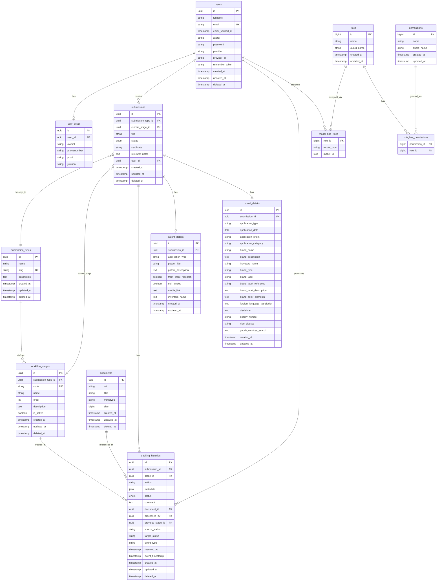

# PKKI ITERA Database Schema Documentation

## Database Overview
This document provides a comprehensive overview of the PKKI ITERA database schema, including all tables, relationships, and business logic constraints.

**Database Engine**: MySQL  
**Character Set**: utf8mb4_unicode_ci  
**Primary Key Strategy**: UUID (char(36))  
**Soft Deletes**: Implemented on core entities  

## Complete Table Structure

### Core Tables Summary
| Table Name | Purpose | Key Relationships |
|------------|---------|------------------|
| `users` | User authentication and basic info | → `user_detail`, `submissions`, `tracking_histories` |
| `user_detail` | Extended user information | ← `users` |
| `submissions` | Main IP application entity | ← `users`, `submission_types`, `workflow_stages` |
| `submission_types` | Types of IP (patent, brand, etc.) | → `submissions`, `workflow_stages` |
| `workflow_stages` | Process stages for each submission type | ← `submission_types`, → `tracking_histories` |
| `tracking_histories` | Audit trail of submission progress | ← `submissions`, `workflow_stages`, `users` |
| `documents` | File storage metadata | → `submission_documents`, `tracking_histories` |
| `patent_details` | Patent-specific information | ← `submissions` |
| `brand_details` | Trademark-specific information | ← `submissions` |
| `haki_details` | Copyright-specific information | ← `submissions` |
| `industrial_design_details` | Industrial design information | ← `submissions` |

## Detailed Entity Schemas

### 1. User Management

#### `users` - Core User Entity
```sql
CREATE TABLE users (
    id CHAR(36) PRIMARY KEY,
    fullname VARCHAR(255) NOT NULL,
    email VARCHAR(255) UNIQUE NOT NULL,
    email_verified_at TIMESTAMP NULL,
    avatar VARCHAR(255) NULL,
    password VARCHAR(255) NULL,
    provider VARCHAR(255) NOT NULL DEFAULT 'local',
    provider_id VARCHAR(255) NULL,
    remember_token VARCHAR(100) NULL,
    created_at TIMESTAMP NULL,
    updated_at TIMESTAMP NULL,
    deleted_at TIMESTAMP NULL,
    
    INDEX idx_email (email),
    INDEX idx_fullname (fullname),
    INDEX idx_provider (provider)
);
```

**Business Rules:**
- `provider` values: 'local', 'google', 'sso_itera'
- `password` can be NULL for OAuth users
- `email` must be unique across all providers
- Soft deletes implemented for data retention

#### `user_detail` - Extended User Information
```sql
CREATE TABLE user_detail (
    id CHAR(36) PRIMARY KEY,
    user_id CHAR(36) NOT NULL,
    alamat VARCHAR(255) NULL,
    phonenumber VARCHAR(255) NULL,
    prodi VARCHAR(255) NULL,
    jurusan VARCHAR(255) NULL,
    
    FOREIGN KEY (user_id) REFERENCES users(id) ON DELETE CASCADE,
    UNIQUE KEY unique_user_detail (user_id)
);
```

### 2. Submission System

#### `submissions` - Main Application Entity
```sql
CREATE TABLE submissions (
    id CHAR(36) PRIMARY KEY,
    submission_type_id CHAR(36) NOT NULL,
    current_stage_id CHAR(36) NULL,
    title VARCHAR(255) NOT NULL,
    status ENUM('draft','submitted','in_review','revision_needed','approved','rejected','completed','cancelled') NOT NULL DEFAULT 'draft',
    certificate VARCHAR(255) NULL,
    reviewer_notes TEXT NULL,
    user_id CHAR(36) NOT NULL,
    created_at TIMESTAMP NULL,
    updated_at TIMESTAMP NULL,
    deleted_at TIMESTAMP NULL,
    
    FOREIGN KEY (submission_type_id) REFERENCES submission_types(id),
    FOREIGN KEY (current_stage_id) REFERENCES workflow_stages(id),
    FOREIGN KEY (user_id) REFERENCES users(id),
    
    INDEX idx_status (status),
    INDEX idx_user_type (user_id, submission_type_id),
    INDEX idx_created_at (created_at)
);
```

**Status Flow:**
```
draft → submitted → in_review → (approved|rejected|revision_needed) → completed
                              ↘ revision_needed → in_review (loop)
```

#### `submission_types` - IP Categories
```sql
CREATE TABLE submission_types (
    id CHAR(36) PRIMARY KEY,
    name VARCHAR(255) NOT NULL,
    slug VARCHAR(255) UNIQUE NOT NULL,
    description TEXT NULL,
    created_at TIMESTAMP NULL,
    updated_at TIMESTAMP NULL,
    deleted_at TIMESTAMP NULL,
    
    INDEX idx_slug (slug)
);
```

**Standard Types:**
- Patent (`paten`)
- Trademark (`brand`)
- Copyright (`haki`)
- Industrial Design (`industrial_design`)

### 3. Workflow Management

#### `workflow_stages` - Process Definition
```sql
CREATE TABLE workflow_stages (
    id CHAR(36) PRIMARY KEY,
    submission_type_id CHAR(36) NOT NULL,
    code VARCHAR(255) UNIQUE NOT NULL,
    name VARCHAR(255) NOT NULL,
    order INT NOT NULL,
    description TEXT NULL,
    is_active BOOLEAN NOT NULL DEFAULT TRUE,
    created_at TIMESTAMP NULL,
    updated_at TIMESTAMP NULL,
    deleted_at TIMESTAMP NULL,
    
    FOREIGN KEY (submission_type_id) REFERENCES submission_types(id),
    
    INDEX idx_type_order (submission_type_id, order),
    UNIQUE KEY unique_type_code (submission_type_id, code)
);
```

#### `tracking_histories` - Audit Trail
```sql
CREATE TABLE tracking_histories (
    id CHAR(36) PRIMARY KEY,
    submission_id CHAR(36) NOT NULL,
    stage_id CHAR(36) NOT NULL,
    action VARCHAR(255) NOT NULL DEFAULT 'state_change',
    metadata JSON NULL,
    status ENUM('started','in_progress','approved','rejected','revision_needed','objection','completed') NOT NULL DEFAULT 'started',
    comment TEXT NULL,
    document_id CHAR(36) NULL,
    processed_by CHAR(36) NULL,
    previous_stage_id CHAR(36) NULL,
    source_status VARCHAR(255) NULL,
    target_status VARCHAR(255) NULL,
    event_type VARCHAR(255) NULL DEFAULT 'state_change',
    resolved_at TIMESTAMP NULL,
    event_timestamp TIMESTAMP NOT NULL DEFAULT CURRENT_TIMESTAMP,
    created_at TIMESTAMP NULL,
    updated_at TIMESTAMP NULL,
    deleted_at TIMESTAMP NULL,
    
    FOREIGN KEY (submission_id) REFERENCES submissions(id),
    FOREIGN KEY (stage_id) REFERENCES workflow_stages(id),
    FOREIGN KEY (document_id) REFERENCES documents(id),
    FOREIGN KEY (processed_by) REFERENCES users(id),
    FOREIGN KEY (previous_stage_id) REFERENCES workflow_stages(id),
    
    INDEX idx_submission_stage (submission_id, stage_id),
    INDEX idx_status_event (status, event_type),
    INDEX idx_event_timestamp (event_timestamp)
);
```

### 4. Document Management

#### `documents` - File Storage
```sql
CREATE TABLE documents (
    id CHAR(36) PRIMARY KEY,
    uri VARCHAR(255) NOT NULL,
    title VARCHAR(255) NOT NULL,
    mimetype VARCHAR(255) NULL,
    size BIGINT NULL,
    created_at TIMESTAMP NULL,
    updated_at TIMESTAMP NULL,
    deleted_at TIMESTAMP NULL,
    
    INDEX idx_uri (uri),
    INDEX idx_mimetype (mimetype)
);
```

#### `submission_documents` - Document Links
```sql
CREATE TABLE submission_documents (
    id CHAR(36) PRIMARY KEY,
    submission_id CHAR(36) NOT NULL,
    document_id CHAR(36) NOT NULL,
    document_type VARCHAR(255) NULL,
    created_at TIMESTAMP NULL,
    updated_at TIMESTAMP NULL,
    
    FOREIGN KEY (submission_id) REFERENCES submissions(id) ON DELETE CASCADE,
    FOREIGN KEY (document_id) REFERENCES documents(id) ON DELETE CASCADE,
    
    UNIQUE KEY unique_submission_document (submission_id, document_id)
);
```

### 5. IP-Specific Details

#### `patent_details` - Patent Information
```sql
CREATE TABLE patent_details (
    id CHAR(36) PRIMARY KEY,
    submission_id CHAR(36) NOT NULL,
    application_type VARCHAR(255) NOT NULL,
    patent_title VARCHAR(255) NOT NULL,
    patent_description TEXT NOT NULL,
    from_grant_research BOOLEAN NOT NULL,
    self_funded BOOLEAN NOT NULL,
    media_link TEXT NULL,
    inventors_name TEXT NULL,
    created_at TIMESTAMP NULL,
    updated_at TIMESTAMP NULL,
    
    FOREIGN KEY (submission_id) REFERENCES submissions(id) ON DELETE CASCADE,
    UNIQUE KEY unique_patent_submission (submission_id)
);
```

#### `brand_details` - Trademark Information
```sql
CREATE TABLE brand_details (
    id CHAR(36) PRIMARY KEY,
    submission_id CHAR(36) NOT NULL,
    application_type VARCHAR(255) NOT NULL,
    application_date DATE NOT NULL,
    application_origin VARCHAR(255) NOT NULL,
    application_category VARCHAR(255) NOT NULL,
    brand_name VARCHAR(255) NOT NULL,
    brand_description TEXT NOT NULL,
    inovators_name VARCHAR(255) NOT NULL,
    brand_type VARCHAR(255) NOT NULL,
    brand_label VARCHAR(255) NOT NULL,
    brand_label_reference VARCHAR(255) NULL,
    brand_label_description TEXT NOT NULL,
    brand_color_elements TEXT NULL,
    foreign_language_translation TEXT NULL,
    disclaimer TEXT NULL,
    priority_number VARCHAR(255) NULL,
    nice_classes VARCHAR(255) NOT NULL,
    goods_services_search TEXT NULL,
    created_at TIMESTAMP NULL,
    updated_at TIMESTAMP NULL,
    
    FOREIGN KEY (submission_id) REFERENCES submissions(id) ON DELETE CASCADE,
    UNIQUE KEY unique_brand_submission (submission_id),
    INDEX idx_brand_name (brand_name),
    INDEX idx_nice_classes (nice_classes)
);
```

#### `industrial_design_details` - Design Information
```sql
CREATE TABLE industrial_design_details (
    id CHAR(36) PRIMARY KEY,
    submission_id CHAR(36) NOT NULL,
    design_type VARCHAR(255) NOT NULL,
    design_description TEXT NOT NULL,
    novelty_statement TEXT NOT NULL,
    designer_information TEXT NOT NULL,
    locarno_class VARCHAR(255) NULL,
    filing_date DATE NULL,
    application_number VARCHAR(255) NULL,
    registration_date DATE NULL,
    registration_number VARCHAR(255) NULL,
    expiration_date DATE NULL,
    created_at TIMESTAMP NULL,
    updated_at TIMESTAMP NULL,
    
    FOREIGN KEY (submission_id) REFERENCES submissions(id) ON DELETE CASCADE,
    UNIQUE KEY unique_design_submission (submission_id)
);
```

### 6. Authorization System (Spatie Permission)

#### `roles` - Role Definitions
```sql
CREATE TABLE roles (
    id BIGINT UNSIGNED PRIMARY KEY AUTO_INCREMENT,
    name VARCHAR(255) NOT NULL,
    guard_name VARCHAR(255) NOT NULL,
    created_at TIMESTAMP NULL,
    updated_at TIMESTAMP NULL,
    
    UNIQUE KEY unique_name_guard (name, guard_name)
);
```

**Standard Roles:**
- `super_admin` - System administrator
- `admin` - Administrative staff
- `civitas` - ITERA community (students, faculty, staff)
- `non-civitas` - External users

#### `permissions` - Permission Definitions
```sql
CREATE TABLE permissions (
    id BIGINT UNSIGNED PRIMARY KEY AUTO_INCREMENT,
    name VARCHAR(255) NOT NULL,
    guard_name VARCHAR(255) NOT NULL,
    created_at TIMESTAMP NULL,
    updated_at TIMESTAMP NULL,
    
    UNIQUE KEY unique_name_guard (name, guard_name)
);
```

**Permission Patterns:**
- `view_any_submission`, `view_submission`, `create_submission`, `update_submission`, `delete_submission`
- `view_any_user`, `view_user`, `create_user`, `update_user`, `delete_user`
- `access_admin_panel`, `manage_settings`, `view_logs`

## Entity Relationship Diagram



## Data Migration Strategy

### Database Versioning
- All migrations use timestamp prefixes
- Foreign key constraints properly defined
- Indexes added for performance-critical queries
- Soft deletes implemented on core entities

### Key Constraints
```sql
-- Foreign Key Constraints
ALTER TABLE submissions ADD CONSTRAINT fk_submissions_user 
    FOREIGN KEY (user_id) REFERENCES users(id);
    
ALTER TABLE submissions ADD CONSTRAINT fk_submissions_type 
    FOREIGN KEY (submission_type_id) REFERENCES submission_types(id);
    
ALTER TABLE tracking_histories ADD CONSTRAINT fk_tracking_submission 
    FOREIGN KEY (submission_id) REFERENCES submissions(id);

-- Unique Constraints
ALTER TABLE user_detail ADD CONSTRAINT unique_user_detail 
    UNIQUE (user_id);
    
ALTER TABLE patent_details ADD CONSTRAINT unique_patent_submission 
    UNIQUE (submission_id);
```

## Performance Considerations

### Recommended Indexes
```sql
-- Core performance indexes
CREATE INDEX idx_submissions_status_created ON submissions(status, created_at);
CREATE INDEX idx_tracking_submission_timestamp ON tracking_histories(submission_id, event_timestamp);
CREATE INDEX idx_users_email_provider ON users(email, provider);
CREATE INDEX idx_workflow_type_active_order ON workflow_stages(submission_type_id, is_active, order);

-- Full-text search indexes (if needed)
CREATE FULLTEXT INDEX ft_submissions_title ON submissions(title);
CREATE FULLTEXT INDEX ft_patent_description ON patent_details(patent_description);
```

### Query Optimization Guidelines
- Always use proper eager loading for relationships
- Implement proper pagination for large datasets
- Use database-level constraints for data integrity
- Consider read replicas for reporting queries

---

**Last Updated**: May 31, 2025  
**Database Version**: MySQL 8.0+  
**Laravel Version**: 10.x  
**Documentation Maintained By**: PKKI ITERA Development Team
